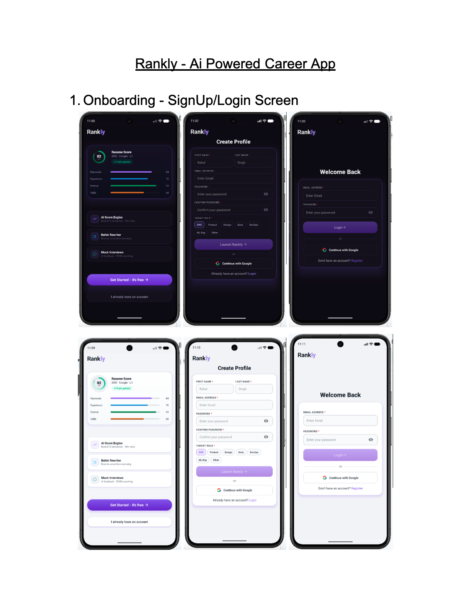
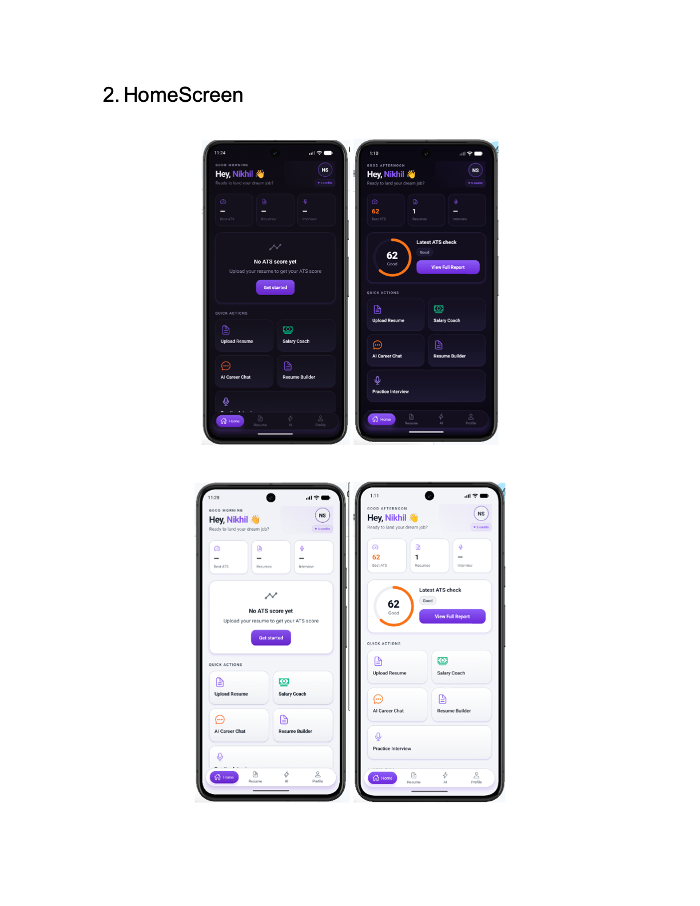
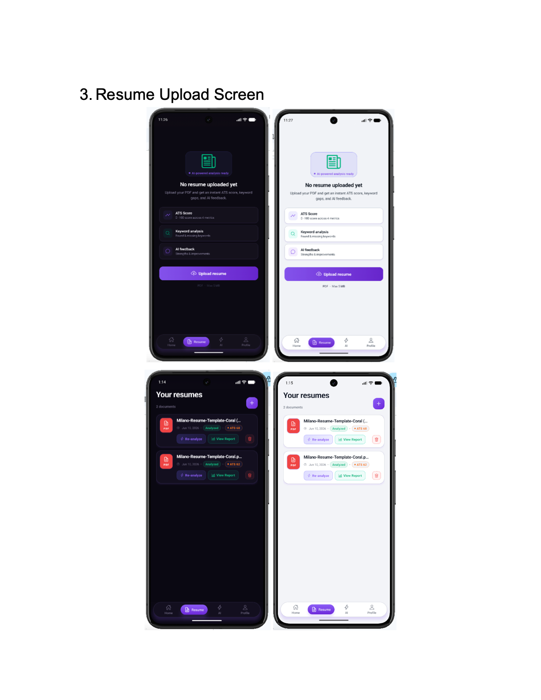
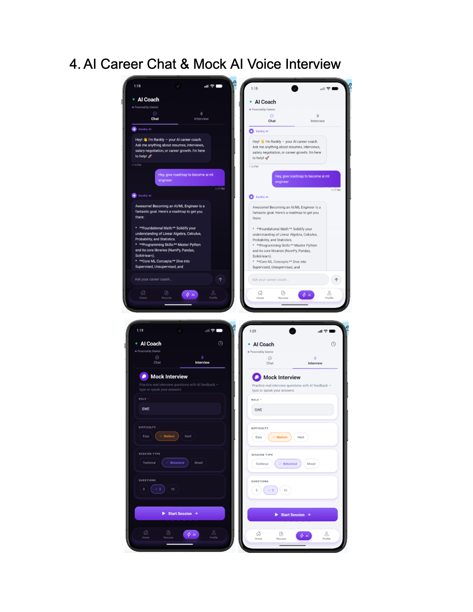
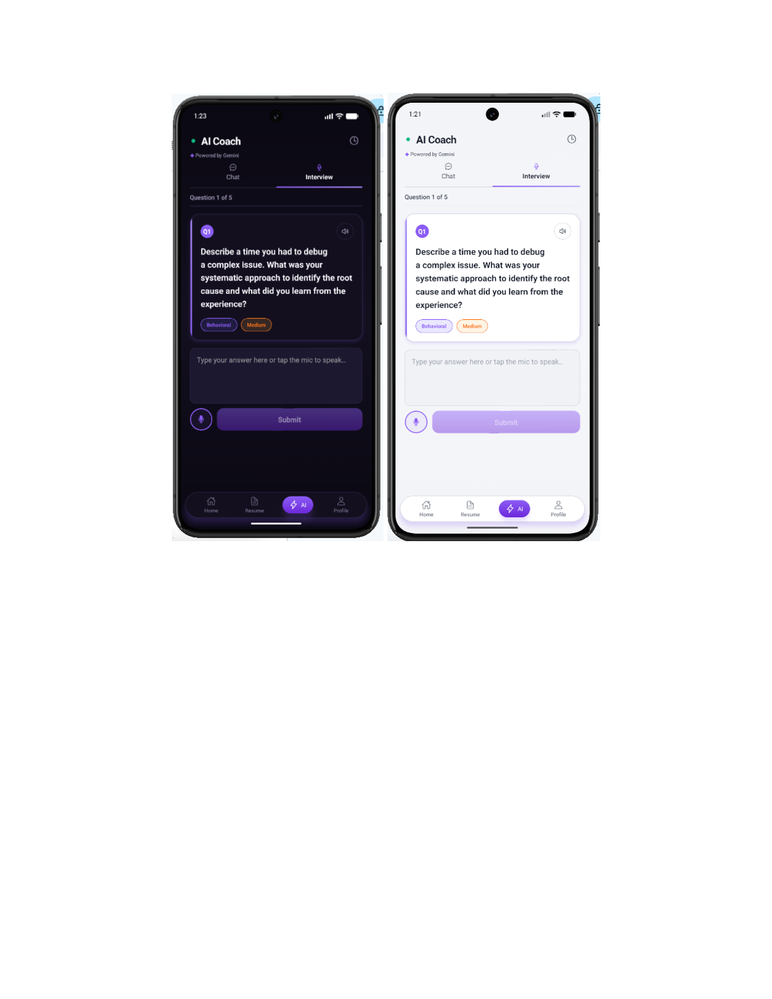
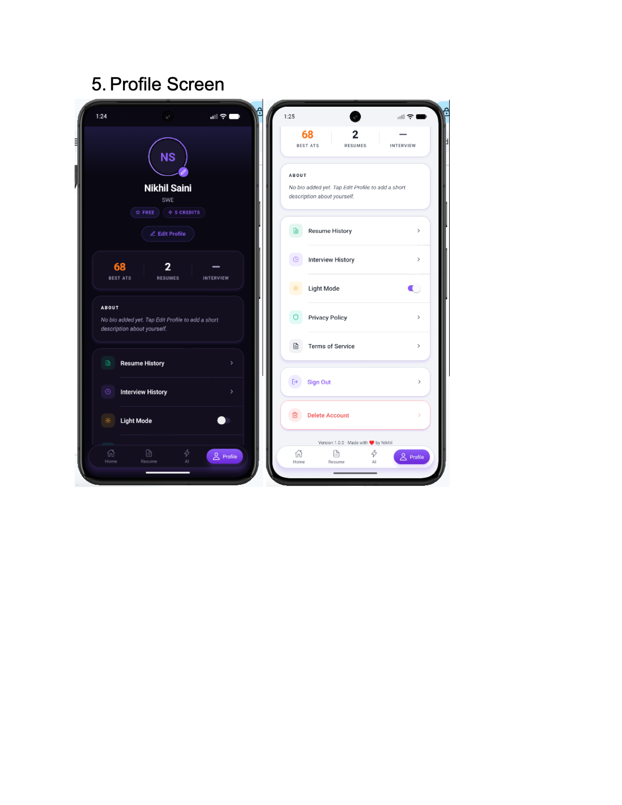
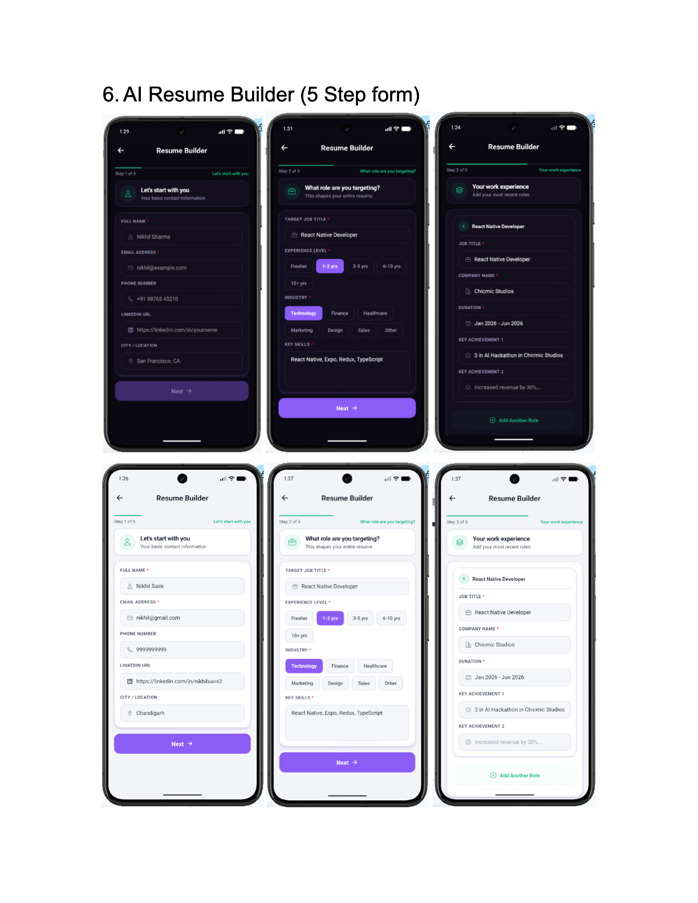
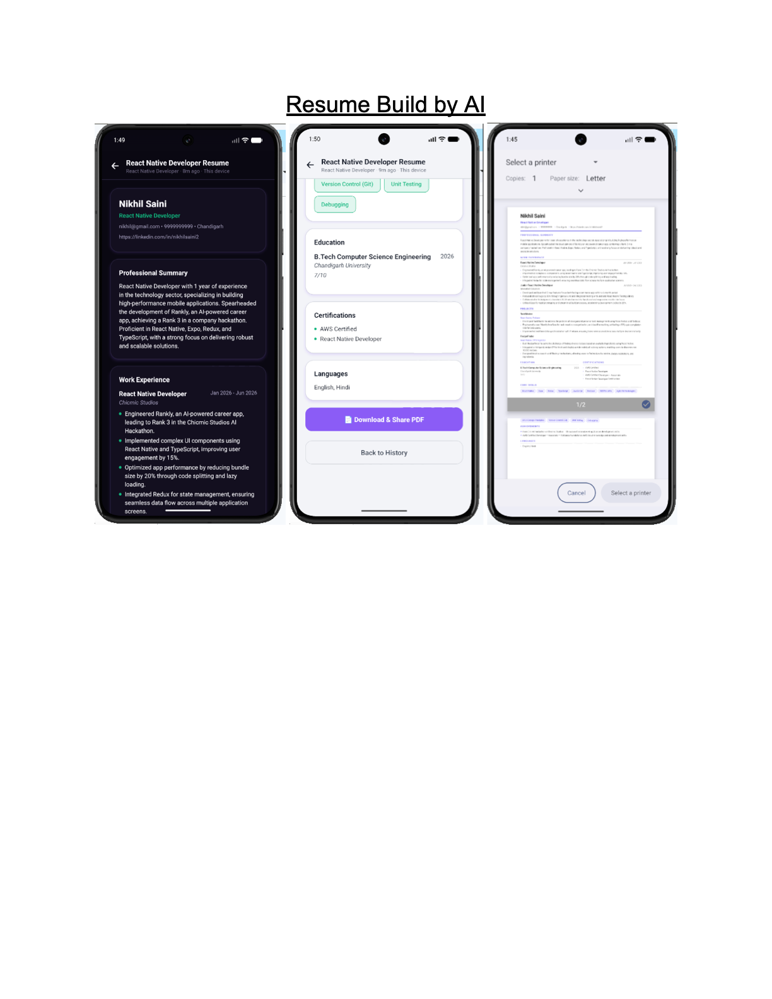
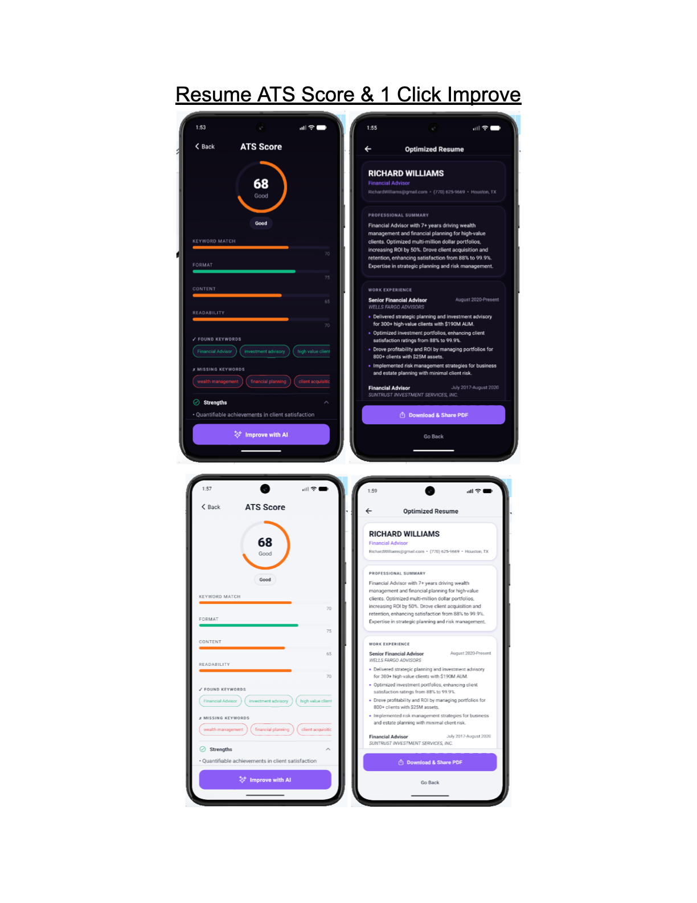

# 🚀 Rankly - AI Powered Career App

[](https://reactnative.dev/)
[](https://expo.dev/)
[](https://www.typescriptlang.org/)
[](https://ai.google.dev/)
[](https://supabase.com/)
[](https://redux-toolkit.js.org/)

**Rankly** is an advanced, production-grade mobile application designed to be your ultimate career co-pilot. Built with **React Native (Expo)** and powered by **Google Gemini AI** and **Supabase**, Rankly helps job seekers build industry-standard resumes, analyze ATS scores, practice mock voice interviews, and master salary negotiations.

---

## 📸 App Tour & Showcase

Here is a visual overview of **Rankly's** design, flow, and key feature slides:

<p align="center">
  
</p>

### 🚀 Core Modules & User Flows

<p align="center">
  
  
</p>

<p align="center">
  
  
</p>

<p align="center">
  
  
</p>

<p align="center">
  
  
</p>

---

## 🌟 Key Features

### 📄 1. ATS Scoring & Resume Analyzer

- **Multi-Metric Analysis:** Analyzes your resume based on keyword density, formatting, content relevance, and readability.
- **Keyword Gap Finder:** Extracts found keywords and identifies missing industry-specific terms.
- **Detailed AI Feedback:** Detailed sections of strengths, target improvements, and a clean overall score ring.
- **Supabase File Integration:** Seamless PDF uploading and raw text parsing.

### 🎙️ 2. Interactive Mock Voice Interview Engine

- **Fully Customized Sessions:** Select your target role, difficulty (Easy, Medium, Hard), type (Technical, Behavioral, Mixed), and number of questions.
- **Voice-First Experience:** Uses Native Text-to-Speech (TTS) for the interviewer and Speech-to-Text (STT) for capturing your responses.
- **Real-time Evaluation:** Deep AI grading (0-100 score) for every answer, highlighting specific strengths, missing points, and tips.
- **State Preservation:** Auto-saves progress locally so you can resume the interview even if you navigate away.

### 🛠️ 3. 5-Step AI Resume Builder

- **Guided Step-by-Step Flow:** Personal Info ➜ Career Profile ➜ Work Experience ➜ Education ➜ Preferences.
- **Autosave Draft System:** Debounced autosaving (every 500ms) to `AsyncStorage` protects against accidental losses.
- **PDF Export & Share:** Instantly exports your polished, AI-optimized resume into PDF layout ready to share or print.

### 💰 4. Salary Negotiation Coach

- **Market Estimation:** Evaluates salary offers against job level, location, industry, and experience.
- **Negotiation Toolkits:** Generates personalized verbal scripts, professional email templates, leverage points, and key tactics.
- **Suggested Ask Calculator:** Recommends optimal counter-offers with safe guards to keep target requirements realistic.

### 💬 5. AI Career Coach (Chat)

- **Conversational AI Partner:** Always-available career mentor for resume review, career roadmaps, or job search tactics.
- **ATS Contextual Integration:** Automatically loads your ATS score and resume context directly into the chat for personalized advice.

### 🌓 6. Premium Theme & UI Design

- **Glassmorphic Aesthetics:** Futuristic dark mode as the default, with a clean light mode option.
- **Animated Elements:** Beautiful animations driven by `react-native-reanimated`.
- **Zero System Bar Gaps:** Deep integration with Android and iOS system bars (`expo-navigation-bar`) for seamless UI transitions.

---

## 🛠️ Tech Stack & Architecture

| Layer                       | Technologies Used                                              |
| --------------------------- | -------------------------------------------------------------- |
| **Framework**               | React Native (Expo Managed Workflow)                           |
| **Language**                | TypeScript (Strict Mode)                                       |
| **Navigation**              | React Navigation v6 (Native Stack + Floating Tab Bar)          |
| **State Management**        | Redux Toolkit (Theme & System State) + `useReducer` (Features) |
| **Artificial Intelligence** | Google Gemini API (`gemini-2.5-flash-lite`, v1 endpoint)       |
| **Backend & Database**      | Supabase (Auth, PostgreSQL DB, Edge Functions, Storage)        |
| **Styling & Theme**         | Custom Design System (Dynamic tokens for Dark/Light mode)      |
| **Hardware APIs**           | `expo-speech` (TTS) & `expo-speech-recognition` (STT)          |

---

## 📂 Project Structure

```text
Rankly/
├── App.tsx                     # Root App entry & context providers
├── GLOBAL_CONTEXT.md           # Unified developer reference context
├── src/
│   ├── components/
│   │   ├── atoms/              # UI Buttons, Cards, Scores, Badge, AppName, etc.
│   │   ├── molecules/          # Complex UI components like LocationAutocomplete
│   │   └── layouts/            # Reusable header and action layout wrappers
│   ├── feature/
│   │   ├── interview/          # Mock Interview screens, hooks, and services
│   │   └── resume/             # Resume Builder, ATS Score pages, and PDF viewer
│   ├── services/
│   │   ├── gemini/             # Gemini API client, system prompts, and rate limiters
│   │   └── supabase/           # Supabase Client initializations and Auth helpers
│   ├── screens/
│   │   ├── home/               # HomeScreen featuring career overview & quick actions
│   │   ├── ai/                 # Dual-segmented screen (AI Coach Chat / Mock Interview)
│   │   ├── profile/            # User settings, history, and avatar uploading
│   │   └── salary/             # Salary Coach inputs, loaders, and analysis results
│   ├── store/                  # Redux configurations, ThemeSlice, and hydration
│   ├── theme/                  # Design tokens, elevation parameters, and typography
│   └── utils/                  # Resilience helpers, validators, and score calculation
```

---

## 🚀 Getting Started

Follow these steps to run the application locally.

### 1. Prerequisites

Make sure you have Node.js and Expo CLI installed.

- [Node.js (v18+)](https://nodejs.org/)
- [Expo Go app](https://expo.dev/client) installed on your mobile device (to run on physical hardware).

### 2. Clone and Install Dependencies

```bash
# Clone the repository
git clone https://github.com/nikhilsaini2/Rankly.git
cd Rankly

# Install packages
npm install
```

### 3. Configure Environment Variables

Create a `.env` file in the root directory and copy the contents from `.env.example`:

```env
EXPO_PUBLIC_SUPABASE_URL=https://your-supabase-project.supabase.co
EXPO_PUBLIC_SUPABASE_ANON_KEY=your-supabase-anon-key
EXPO_PUBLIC_GEMINI_API_KEY=your-fallback-gemini-key
```

_Note: The primary Gemini API key is fetched dynamically from your Supabase config table (`app_config`), falling back to `EXPO_PUBLIC_GEMINI_API_KEY`._

### 4. Running the Development Server

```bash
# Start Expo development server
npx expo start
```

Use the terminal QR code to load the app in **Expo Go** on Android/iOS, or press `a` (Android) / `i` (iOS) to load it inside a virtual emulator.

---

## 🔒 Supabase Database Schema Overview

Rankly relies on a secure, relational database schema configured in Supabase:

- **`users`**: Contains user metadata, current plan details (`free` vs `pro`), and credit system balances.
- **`resumes`**: Paths to uploaded PDFs in storage, extracted text, and cache tags for scores.
- **`ats_scores`**: ATS analysis reports containing JSON scores, keywords, and AI feedback.
- **`resume_builds`**: History of all resumes created using the AI Resume Builder.
- **`interview_sessions`**: Metrics from mock interview sessions, including answers, difficulty levels, and grading.
- **`salary_negotiations`**: History of salary analyses, leverage scripts, and suggestions.

---

## 🧑‍💻 Author

- **nikhilsaini2** - [GitHub Profile](https://github.com/nikhilsaini2)
